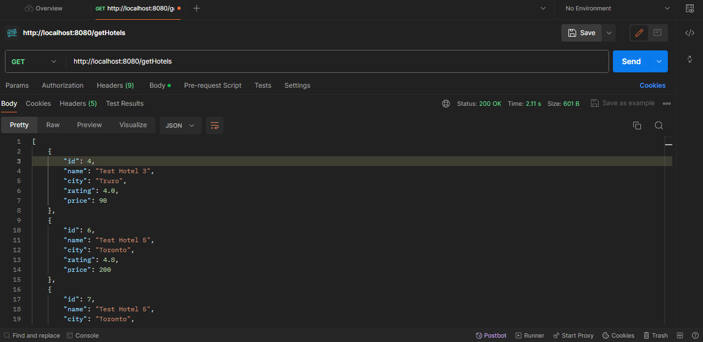
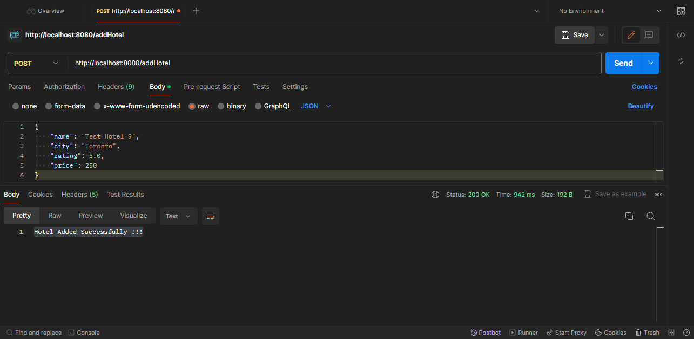
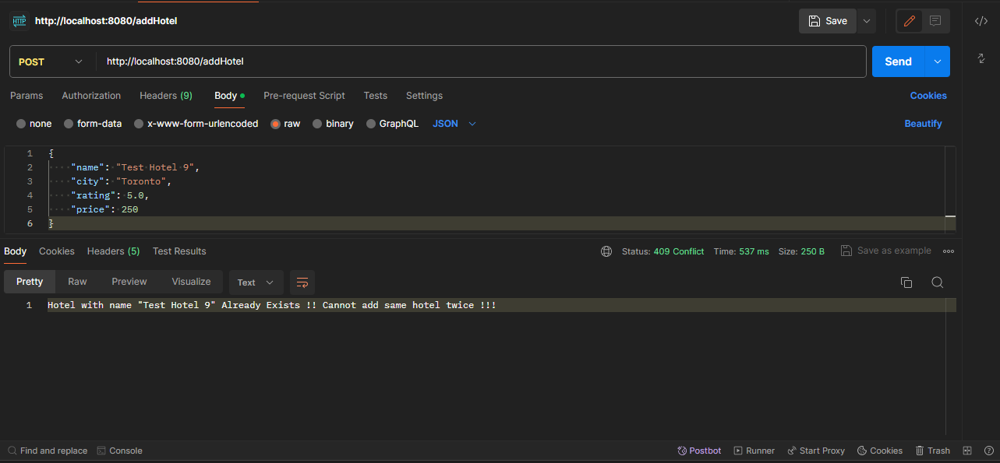

# SpringBoot Assignment: springboot-hotels
This is Springboot Assignment for MCDA5550 - SMU for A00431008

## Description
This assignment provides REST api's to 
 - Get list of hotels as a list of JSON objects 
 - Add Hotel to the database - api consumes details as a JSON Object (Details below)

 ## GET method: gets the list of hotels (as list of JSON objects)
 Please use the following URL to get the list of hotels.
 URL: http://localhost:8080/getHotels
 Sample response:
 [
    {
        "id": 1,
        "name": "Test Hotel 1",
        "city": "Halifax",
        "rating": 4.5,
        "price": 100
    }
]

Screenshot of response for GET api:

## POST Method: adds hotel to the database  
Please use the following URL to add the hotel to the database.   
Please include a body in the given format to successfully post the hotel to the database.  
URL: http://localhost:8080/addHotel  
Sample Body:   
{  
    "name": "Test Hotel 9",  
    "city": "Toronto",  
    "rating": 5.0,  
    "price": 250  
}

Sample response and Screenshots:    
Case I: Post is successful    
Response: Hotel Added Successfully !!!  
Status: 200 OK  
Screenshot:  
  

Case II: Post is unsuccessful --> Hotel already exists in database  
Response: Hotel with name "Test Hotel 9" Already Exists !! Cannot add same hotel twice !!!  
Status: 409 Conflict  
Screenshot:  
